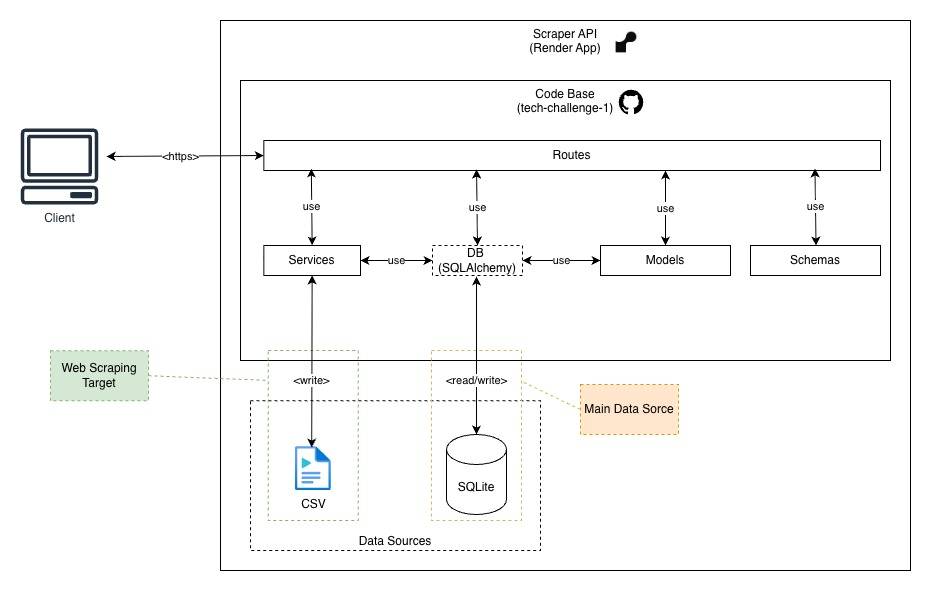
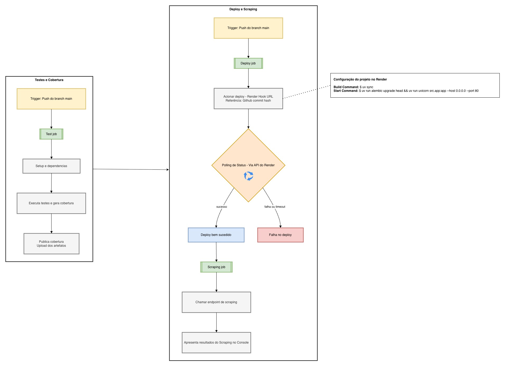
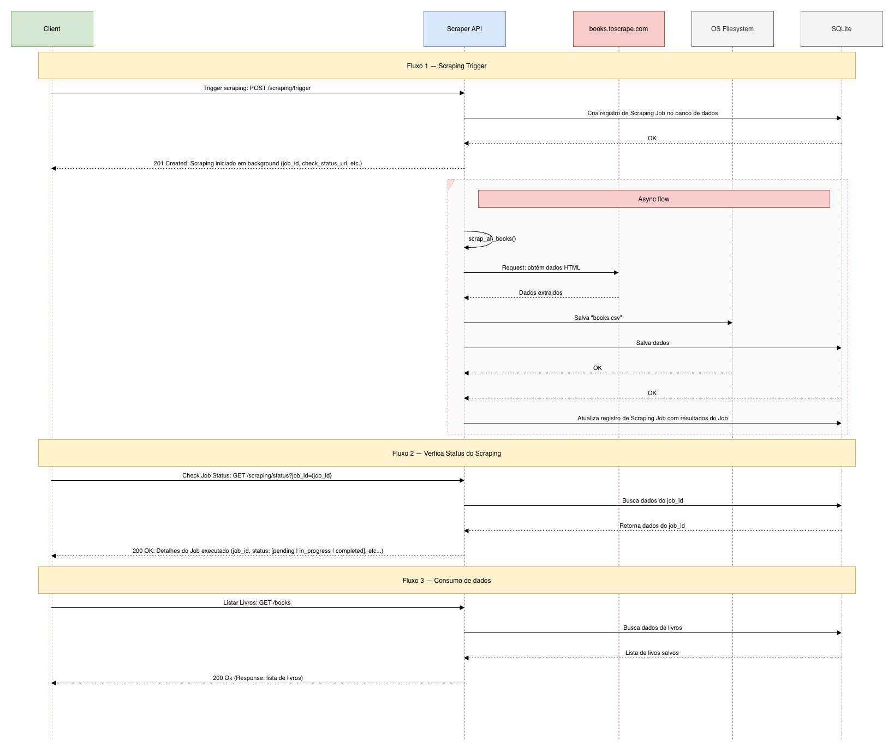

# Tech Challenge 1 - API de Consulta de Livros
Projeto desenvolvido para o Tech Challenge da Fase 1 da Pós-Tech FIAP em Machine Learning Engineering acessível no Repositório Público do Github em [https://github.com/fiap-7MLET/tech-challenge-1](https://github.com/fiap-7MLET/tech-challenge-1).

---

<details>
<summary><strong>🗂 SUMÁRIO</strong></summary>

- [👥 Equipe](#-equipe-)
- [📋 Sobre o Projeto](#-sobre-o-projeto-)
- [🎯 Objetivos do Projeto](#-objetivos-do-projeto-)
- [🚀 Tecnologias Utilizadas](#-tecnologias-utilizadas-)
- [🌐 API Pública](#-api-pública-)
- [💾 Entregáveis Adicionais](#-entregáveis-adicionais-)
  - [🎥 Apresentação em Vídeo](#-apresentação-em-vídeo-)
  - [🎞️ Apresentação de Slides](#️-apresentação-de-slides-)
  - [📊 Coleção Postman](#-coleção-postman-)
- [📦 Instalação e Configuração](#-instalação-e-configuração-)
- [🏃 Como Executar](#-como-executar-)
- [🔧 Endpoints da API](#-endpoints-da-api-)
  - [Endpoints Principais (Obrigatórios)](#endpoints-principais-obrigatórios-)
  - [Endpoints Opcionais (Bônus)](#endpoints-opcionais-bônus-)
- [🌐 Exemplos de Uso](#-exemplos-de-uso-)
- [📁 Estrutura do Projeto](#-estrutura-do-projeto-)
- [🗄️ Banco de Dados](#️-banco-de-dados-)
- [🕷️ Web Scraping](#️-web-scraping-)
- [🧪 Testes](#-testes-)
- [🏗️ Arquitetura e Pipeline de Dados](#️-arquitetura-e-pipeline-de-dados-)
- [🏗️ CI/CD](#cicd-)
- [🎓 Cenário de Uso para ML](#-cenário-de-uso-para-ml-)
- [📄 Licença](#-licença-)
</details>

---
## 👥 Equipe [↑](#tech-challenge-1---api-de-consulta-de-livros)

Desenvolvido como parte do Tech Challenge - Fase 1
Pós-Tech FIAP - Machine Learning Engineering

| Nome Completo | RM | Google Skills | Github |
|---------------|----|--------------------|-------------|
| Allan Vital | RM369068 | [Badge](https://www.skills.google/public_profiles/6336cac1-9227-4eeb-969e-dedafd67c003) | [@vitallan](https://github.com/vitallan) |
| Beatriz Mendonça | RM367076 | [Badge](https://www.skills.google/public_profiles/7a5f64c0-9f90-4302-afaa-2f6024bdae53) | [@beamendon](https://github.com/beamendon) |
| Fernando Nunes | RM368361 | [Badge](https://www.skills.google/public_profiles/eef5e153-41c5-497d-bfd5-8f69ab2f1883) | [@fernandoleitao](https://github.com/fernandoleitao) |
| Nhaiara Moura | RM368096 | [Badge](https://www.skills.google/public_profiles/f1ae1664-8b59-4214-bbf9-086a19dc8faa) | [@nhaiara](https://github.com/nhaiara) |
| Rafael Melazzo | RM368728 | [Badge](https://www.skills.google/public_profiles/86e31f1d-0273-482f-af15-00e559df7961) | [@rafaelmelazzo](https://github.com/rafaelmelazzo) |

## 📋 Sobre o Projeto [↑](#tech-challenge-1---api-de-consulta-de-livros)

API REST pública desenvolvida com FastAPI para gerenciamento e consulta de catálogo de livros. O projeto inclui funcionalidade completa de web scraping para coleta automática de dados do site [books.toscrape.com](https://books.toscrape.com/), armazenamento em banco de dados SQLite e disponibilização via endpoints RESTful.


## 🎯 Objetivos do Projeto [↑](#tech-challenge-1---api-de-consulta-de-livros)

- Desenvolver um pipeline completo de extração, transformação e disponibilização de dados
- Criar uma API pública escalável e reusável para futuros modelos de Machine Learning
- Implementar web scraping robusto com processamento assíncrono
- Fornecer endpoints RESTful bem documentados e testados
- Apresentar o projeto em vídeo

## 🚀 Tecnologias Utilizadas [↑](#tech-challenge-1---api-de-consulta-de-livros)

- **FastAPI** - Framework web moderno e rápido para construção de APIs
- **SQLAlchemy** - ORM para gerenciamento do banco de dados
- **httpx** - Cliente HTTP assíncrono para web scraping
- **BeautifulSoup4** - Parser HTML para extração de dados
- **Pydantic** - Validação de dados e serialização
- **Uvicorn** - Servidor ASGI de alta performance
- **Pytest** - Framework de testes
- **uv** - Gerenciador moderno de dependências e ambientes virtuais Python

## 🌐 API Pública [↑](#tech-challenge-1---api-de-consulta-de-livros)

- [https://tech-challenge-1-7zyn.onrender.com/docs](https://tech-challenge-1-7zyn.onrender.com/docs)

## 💾 Entregáveis Adicionais [↑](#tech-challenge-1---api-de-consulta-de-livros)

- ### 🎥 Apresentação em Vídeo [↑](#tech-challenge-1---api-de-consulta-de-livros)
  - Veja os detalhes e explicação sobre o nosso projeto na nossa [apresentação em vídeo](https://drive.google.com/file/d/1RqUlpd3zPc5sA--CU2jniGa7yYpYW_nc/view).

- ### 🎞️ Apresentação de Slides [↑](#tech-challenge-1---api-de-consulta-de-livros)
  - Acesse os slides [aqui](https://docs.google.com/presentation/d/1HfFd1JdZnVFsXir5gKII77OlkZJQyAfkj0i3a_KLE_U/edit?usp=sharing).

- ### 📊 Coleção Postman [↑](#tech-challenge-1---api-de-consulta-de-livros)
  Uma coleção Postman completa está disponível em `Tech_Challenge_API.postman_collection.json` com todos os endpoints configurados e exemplos de requisições.
  #### Importar no Postman
    1. Abra o Postman
    2. Clique em "Import"
    3. Selecione o arquivo `Tech_Challenge_API.postman_collection.json`
    4. A coleção estará disponível com todos os endpoints pré-configurados

## 📦 Instalação e Configuração [↑](#tech-challenge-1---api-de-consulta-de-livros)

### Pré-requisitos

- Python 3.11 ou superior
- [uv](https://github.com/astral-sh/uv) instalado

### Passos de Instalação

```bash
# 1. Clone o repositório
git clone https://github.com/fiap-7MLET/tech-challenge-1.git
cd tech-challenge-1

# 2. Instale as dependências usando uv
uv sync

# 3. (Opcional) Ative o ambiente virtual
source .venv/bin/activate  # Linux/Mac
# ou
.venv\Scripts\activate  # Windows
```

### Configuração de Variáveis de Ambiente

Crie um arquivo `.env` na raiz do projeto:

```env
DATABASE_URL=sqlite:///db.sqlite3
DEBUG=False
```

## 🏃 Como Executar [↑](#tech-challenge-1---api-de-consulta-de-livros)

### Aplicar Migrations do Banco de Dados

**IMPORTANTE**: Antes de iniciar a aplicação pela primeira vez, você deve aplicar as migrations do banco de dados:

```bash
uv run alembic upgrade head
```

Este comando irá:
1. Criar o arquivo de banco de dados SQLite (`db.sqlite3`)
2. Criar todas as tabelas necessárias (books, users, scraping_jobs)
3. Configurar o versionamento do esquema do banco

### Iniciar o Servidor de Desenvolvimento

```bash
uv run uvicorn src.app:app --host 0.0.0.0 --port 8000 --reload
```

A aplicação estará disponível em:
- **API**: http://localhost:8000
- **Documentação Swagger**: http://localhost:8000/docs
- **ReDoc**: http://localhost:8000/redoc

### Popular o Banco de Dados

Antes de usar a API, popule o banco de dados com dados dos livros:

```bash
curl -X POST http://localhost:8000/scraping/trigger
```

Este comando irá:
1. **Iniciar o scraping em background** (retorna imediatamente com um `job_id`)
2. Fazer scraping de aproximadamente 1000 livros do site books.toscrape.com
3. Salvar os dados no banco de dados SQLite
4. Gerar um arquivo CSV em `data/books.csv`

Para acompanhar o progresso:

```bash
# Usando o job_id retornado
curl "http://localhost:8000/scraping/status?job_id=1"

# Ou verificar o último job
curl "http://localhost:8000/scraping/status"
```

## 🔧 Endpoints da API [↑](#tech-challenge-1---api-de-consulta-de-livros)

### Endpoints Principais (Obrigatórios) [↑](#tech-challenge-1---api-de-consulta-de-livros)

#### Health Check
- **GET** `/health/` - Verifica o status da API e conectividade com o banco de dados

#### Livros
- **GET** `/books/` - Lista todos os livros com paginação
  - Query params: `page` (default: 1), `per_page` (default: 10)
  - Resposta inclui URLs de navegação: `next`, `previous`
- **GET** `/books/{id}` - Retorna detalhes de um livro específico
- **GET** `/books/search` - Busca livros por título e/ou categoria
  - Query params: `title`, `category`, `page`, `per_page`
  - Resposta inclui URLs de navegação: `next`, `previous`

#### Categorias
- **GET** `/categories/` - Lista todas as categorias disponíveis com paginação
  - Query params: `page` (default: 1), `per_page` (default: 10)
  - Resposta inclui URLs de navegação: `next`, `previous`

#### Scraping (Assíncrono)
- **POST** `/scraping/trigger` - **Inicia** o processo de scraping em background (retorna imediatamente)
  - Resposta inclui `job_id` para acompanhamento
  - Previne execução de múltiplos jobs simultâneos
- **GET** `/scraping/status` - Retorna status do scraping e estatísticas do banco de dados
  - Query params opcionais: `job_id` (para consultar job específico)
  - Retorna informações do último job se `job_id` não for fornecido
  - Inclui: status do job (pending/in_progress/completed/error), progresso, timestamps

### Endpoints Opcionais (Bônus) [↑](#tech-challenge-1---api-de-consulta-de-livros)

#### Estatísticas (Não Implementados)
- **GET** `/stats/overview` - Estatísticas gerais da coleção
- **GET** `/stats/categories` - Estatísticas detalhadas por categoria

#### Livros Extras (Não Implementados)
- **GET** `/books/top-rated` - Livros com melhor avaliação
- **GET** `/books/price-range` - Filtra livros por faixa de preço

#### Machine Learning (Não Implementados)
- **GET** `/ml/features` - Dados formatados para features de ML
- **GET** `/ml/training-data` - Dataset para treinamento
- **POST** `/ml/predictions` - Endpoint para receber predições

#### Autenticação (Não Implementado)
- **POST** `/auth/register` - Registro de usuário
- **POST** `/auth/login` - Login de usuário
- **POST** `/auth/logout` - Logout de usuário
- **POST** `/auth/refresh` - Renovação de token

## 🌐 Exemplos de Uso [↑](#tech-challenge-1---api-de-consulta-de-livros)

A API pode ser testada de duas formas: via **linha de comando (curl)** ou via **Swagger UI (interface gráfica)**. Recomendamos usar o Swagger UI para exploração inicial, pois oferece documentação interativa e validação automática.

### 📖 Acessando a Documentação Interativa [↑](#tech-challenge-1---api-de-consulta-de-livros)

**Swagger UI**: http://localhost:8000/docs
**ReDoc**: http://localhost:8000/redoc

---

### Verificar Status da API [↑](#tech-challenge-1---api-de-consulta-de-livros)

**Via curl:**
```bash
curl http://localhost:8000/health/
```

**Via Swagger:**
1. Acesse http://localhost:8000/docs
2. Localize `GET /health/`
3. Clique em "Try it out" → "Execute"
4. Visualize a resposta com status da API e conectividade do banco

---

### Listar Livros (com paginação) [↑](#tech-challenge-1---api-de-consulta-de-livros)

**Via curl:**
```bash
curl "http://localhost:8000/books/?page=1&per_page=10"
```

**Via Swagger:**
1. Acesse http://localhost:8000/docs
2. Localize `GET /books/`
3. Clique em "Try it out"
4. Ajuste os parâmetros:
   - `page`: 1
   - `per_page`: 10
5. Clique em "Execute"

**Resposta de exemplo:**
```json
{
  "data": [
    {
      "id": 1,
      "title": "A Light in the Attic",
      "price": "51.77",
      "rating": 3,
      "availability": true,
      "category": "Poetry",
      "image": "https://books.toscrape.com/media/cache/2c/da/2cdad67c44b002e7ead0cc35693c0e8b.jpg"
    }
  ],
  "page": 1,
  "per_page": 10,
  "total": 100,
  "pages": 10,
  "next": "http://localhost:8000/books/?page=2&per_page=10",
  "previous": null
}
```

---

### Buscar Livro por ID [↑](#tech-challenge-1---api-de-consulta-de-livros)

**Via curl:**
```bash
curl "http://localhost:8000/books/1"
```

**Via Swagger:**
1. Acesse http://localhost:8000/docs
2. Localize `GET /books/{id}`
3. Clique em "Try it out"
4. Insira o `id` desejado (ex: 1)
5. Clique em "Execute"

**Resposta de exemplo:**
```json
{
  "id": 1,
  "title": "A Light in the Attic",
  "price": "51.77",
  "rating": 3,
  "availability": true,
  "category": "Poetry",
  "image": "https://books.toscrape.com/media/cache/2c/da/2cdad67c44b002e7ead0cc35693c0e8b.jpg"
}
```

---

### Buscar Livros por Título [↑](#tech-challenge-1---api-de-consulta-de-livros)

**Via curl:**
```bash
curl "http://localhost:8000/books/search?title=python&page=1&per_page=10"
```

**Via Swagger:**
1. Acesse http://localhost:8000/docs
2. Localize `GET /books/search`
3. Clique em "Try it out"
4. Preencha os parâmetros:
   - `title`: "python"
   - `page`: 1
   - `per_page`: 10
5. Clique em "Execute"

**Resposta de exemplo:**
```json
{
  "data": [
    {
      "id": 23,
      "title": "Learning Python",
      "price": "30.23",
      "rating": 4,
      "availability": true,
      "category": "Programming",
      "image": "https://books.toscrape.com/media/cache/..."
    }
  ],
  "page": 1,
  "per_page": 10,
  "total": 15,
  "pages": 2,
  "next": "http://localhost:8000/books/search?title=python&per_page=10&page=2",
  "previous": null
}
```

---

### Buscar Livros por Categoria [↑](#tech-challenge-1---api-de-consulta-de-livros)

**Via curl:**
```bash
curl "http://localhost:8000/books/search?category=Fiction&page=1&per_page=10"
```

**Via Swagger:**
1. Acesse http://localhost:8000/docs
2. Localize `GET /books/search`
3. Clique em "Try it out"
4. Preencha:
   - `category`: "Fiction"
   - `page`: 1
   - `per_page`: 10
5. Clique em "Execute"

---

### Listar Todas as Categorias [↑](#tech-challenge-1---api-de-consulta-de-livros)

**Via curl:**
```bash
curl "http://localhost:8000/categories/?page=1&per_page=20"
```

**Via Swagger:**
1. Acesse http://localhost:8000/docs
2. Localize `GET /categories/`
3. Clique em "Try it out"
4. Ajuste:
   - `page`: 1
   - `per_page`: 20
5. Clique em "Execute"

**Resposta de exemplo:**
```json
{
  "data": [
    {"name": "Travel", "count": 11},
    {"name": "Mystery", "count": 32},
    {"name": "Historical Fiction", "count": 14}
  ],
  "page": 1,
  "per_page": 20,
  "total": 50,
  "pages": 3,
  "next": "http://localhost:8000/categories/?page=2&per_page=20",
  "previous": null
}
```

---

### Disparar Processo de Scraping (Assíncrono) [↑](#tech-challenge-1---api-de-consulta-de-livros)

**Via curl:**
```bash
# Inicia o scraping (retorna imediatamente)
curl -X POST http://localhost:8000/scraping/trigger
```

**Via Swagger:**
1. Acesse http://localhost:8000/docs
2. Localize `POST /scraping/trigger`
3. Clique em "Try it out"
4. Clique em "Execute"
5. **Resposta é imediata** - não precisa aguardar

**Resposta de exemplo:**
```json
{
  "status": "started",
  "message": "Scraping iniciado em background",
  "job_id": 1,
  "check_status_url": "/scraping/status?job_id=1"
}
```

**Se já existir um job em andamento:**
```json
{
  "status": "already_running",
  "message": "Já existe um job de scraping em andamento",
  "job_id": 1,
  "job_status": "in_progress"
}
```

---

### Verificar Status do Scraping [↑](#tech-challenge-1---api-de-consulta-de-livros)

**Via curl:**
```bash
# Verifica status de um job específico
curl "http://localhost:8000/scraping/status?job_id=1"

# Ou verifica o último job executado
curl "http://localhost:8000/scraping/status"
```

**Via Swagger:**
1. Acesse http://localhost:8000/docs
2. Localize `GET /scraping/status`
3. Clique em "Try it out"
4. (Opcional) Informe o `job_id`
5. Clique em "Execute"

**Resposta de exemplo (job em andamento):**
```json
{
  "database": {
    "total_books": 150,
    "total_categories": 12,
    "database_populated": true
  },
  "last_job": {
    "job_id": 1,
    "status": "in_progress",
    "started_at": "2025-11-02T20:18:22.229239",
    "completed_at": null,
    "books_scraped": null,
    "books_saved": null,
    "csv_file": null,
    "error_message": null
  }
}
```

**Resposta de exemplo (job concluído):**
```json
{
  "database": {
    "total_books": 999,
    "total_categories": 50,
    "database_populated": true
  },
  "last_job": {
    "job_id": 1,
    "status": "completed",
    "started_at": "2025-11-02T20:18:22.229239",
    "completed_at": "2025-11-02T20:18:52.755027",
    "books_scraped": 1000,
    "books_saved": 1000,
    "csv_file": "data/books.csv",
    "error_message": null
  }
}
```

**Resposta de exemplo (job com erro):**
```json
{
  "database": {
    "total_books": 0,
    "total_categories": 0,
    "database_populated": false
  },
  "last_job": {
    "job_id": 1,
    "status": "error",
    "started_at": "2025-11-02T20:18:22.229239",
    "completed_at": "2025-11-02T20:18:25.123456",
    "books_scraped": null,
    "books_saved": null,
    "csv_file": null,
    "error_message": "Connection timeout to books.toscrape.com"
  }
}
```

---

### 💡 Dicas para Usar o Swagger UI [↑](#tech-challenge-1---api-de-consulta-de-livros)

- **Schemas**: Role até o final da página do Swagger para ver todos os modelos de dados
- **Validação**: O Swagger valida automaticamente os tipos de dados antes de enviar
- **Exemplos**: Clique em "Schema" ao lado de "Example Value" para ver a estrutura completa
- **Download**: Baixe a especificação OpenAPI em http://localhost:8000/openapi.json
- **Autorização**: Quando implementada autenticação, use o botão "Authorize" no topo

## 📁 Estrutura do Projeto [↑](#tech-challenge-1---api-de-consulta-de-livros)

```
tech-challenge-1/
├── src/
│   ├── api/
│   │   └── schemas/          # Schemas Pydantic para validação
│   │       └── book.py
│   ├── models/                # Modelos SQLAlchemy
│   │   ├── book.py
│   │   └── user.py
│   ├── routes/                # Rotas da API (endpoints)
│   │   ├── book_routes.py
│   │   ├── category_routes.py
│   │   ├── health_routes.py
│   │   ├── scraping_routes.py
│   │   ├── stats_routes.py
│   │   ├── ml_routes.py
│   │   └── user_routes.py
│   ├── services/
│   │   └── scraping/         # Lógica de web scraping
│   │       ├── core.py       # Scraper assíncrono principal
│   │       └── file_handler.py  # Manipulação de arquivos CSV
│   ├── extensions.py          # Configuração do banco de dados
│   ├── conf.py                # Configurações gerais
│   └── app.py                 # Aplicação principal FastAPI
├── data/                      # Dados gerados (CSV)
├── migrations/                # Migrations do banco de dados
├── tests/                     # Testes automatizados
├── pyproject.toml            # Configuração de dependências (uv/pip)
├── uv.lock                   # Lock file do uv
├── Tech_Challenge_API.postman_collection.json  # Coleção Postman
└── README.md                 # Este arquivo
```

## 🗄️ Banco de Dados [↑](#tech-challenge-1---api-de-consulta-de-livros)

### Modelo de Dados

O projeto utiliza SQLite como banco de dados com a seguinte estrutura:

**Tabela: books**
- `id` (Integer, PK) - Identificador único
- `title` (String) - Título do livro (único)
- `price` (Numeric) - Preço do livro
- `rating` (Integer) - Avaliação de 1 a 5
- `availability` (Boolean) - Disponibilidade em estoque
- `category` (String) - Categoria do livro
- `image` (String) - URL da imagem

**Tabela: scraping_jobs**
- `id` (Integer, PK) - Identificador único do job
- `status` (String) - Status do job (pending, in_progress, completed, error)
- `started_at` (DateTime) - Timestamp de início do job
- `completed_at` (DateTime) - Timestamp de conclusão do job
- `books_scraped` (Integer) - Número de livros coletados
- `books_saved` (Integer) - Número de livros salvos no banco
- `error_message` (Text) - Mensagem de erro se o job falhou
- `csv_file` (String) - Caminho do arquivo CSV gerado

**Tabela: users** (estrutura criada, endpoints não implementados)
- `id` (Integer, PK) - Identificador único
- `email` (String) - Email do usuário (único)
- `password` (String) - Senha hash

### Gerenciamento do Banco [↑](#tech-challenge-1---api-de-consulta-de-livros)

O banco de dados é gerenciado através do Alembic (migrations). Para criar ou atualizar o banco de dados, execute:

```bash
# Aplicar todas as migrations
uv run alembic upgrade head

# Verificar versão atual do banco
uv run alembic current

# Ver histórico de migrations
uv run alembic history
```

O arquivo do banco é criado em `db.sqlite3` após a primeira execução das migrations.

## 🕷️ Web Scraping [↑](#tech-challenge-1---api-de-consulta-de-livros)

### Características do Scraper

- **Background Processing**: Executa em background com FastAPI BackgroundTasks
- **Status Tracking**: Acompanhamento em tempo real do progresso via job tracking
- **Assíncrono**: Utiliza `httpx` e `asyncio` para máxima performance
- **Robusto**: Tratamento de erros e retry automático
- **Completo**: Extrai todos os campos necessários (título, preço, rating, categoria, imagem)
- **Escalável**: Processa múltiplas páginas em paralelo
- **Logging**: Registra progresso e erros durante a execução
- **Prevenção de Duplicatas**: Impede execução de múltiplos jobs simultâneos

### Execução Assíncrona

O scraping é executado de forma assíncrona, proporcionando:

1. **Resposta Imediata**: A API retorna instantaneamente com um `job_id` ao invés de bloquear
2. **Acompanhamento de Progresso**: Consulte o status a qualquer momento via `/scraping/status?job_id=X`
3. **Estados do Job**:
   - `pending`: Job criado e aguardando início
   - `in_progress`: Scraping em andamento
   - `completed`: Scraping finalizado com sucesso
   - `error`: Erro durante o scraping (com mensagem detalhada)
4. **Proteção Contra Concorrência**: Sistema impede múltiplos jobs simultâneos
5. **Persistência**: Histórico de jobs mantido no banco de dados

### Fonte de Dados [↑](#tech-challenge-1---api-de-consulta-de-livros)

- **URL**: https://books.toscrape.com/
- **Campos Extraídos**:
  - Título do livro
  - Preço (em libras)
  - Rating (1-5 estrelas)
  - Disponibilidade em estoque
  - Categoria
  - URL da imagem

## 🧪 Testes [↑](#tech-challenge-1---api-de-consulta-de-livros)

### Executar Testes

```bash
# Executar todos os testes
uv run pytest

# Executar com output detalhado
uv run pytest -v

# Executar com cobertura de código
uv run pytest --cov=src --cov-report=html
```

### Cobertura de Testes [↑](#tech-challenge-1---api-de-consulta-de-livros)

O projeto inclui testes para:
- ✅ Rotas da API
- ✅ Modelos de dados
- ✅ Schemas Pydantic
- ✅ Funções de scraping
- ✅ Manipulação de arquivos CSV

## 🏗️ Arquitetura e Pipeline de Dados [↑](#tech-challenge-1---api-de-consulta-de-livros)

### Visão Geral

A imagem ilustra a arquitetura lógica da API, destacando a separação de responsabilidades entre as principais camadas do código e suas interações com as fontes de dados.

<br/>

- **Routes**: define os endpoints da aplicação, atua como ponto de entrada das requisições HTTP e encaminha as chamadas para as demais camadas conforme o tipo de operação solicitada.
- **Services**: centraliza a lógica de negócio da aplicação, orquestra o fluxo entre as rotas, modelos e fontes de dados, e controla o processo de scraping, leitura e escrita no banco e no CSV.
- **Models**: representa as entidades do domínio do sistema, implementa o mapeamento objeto-relacional via SQLAlchemy e garante consistência entre os objetos da aplicação e as tabelas do banco.
- **Schemas**: define os modelos de entrada e saída de dados da API com Pydantic, assegurando a validação e serialização das informações trafegadas entre o cliente e o servidor.
- **Data Sources**: compreende as camadas de persistência da aplicação, sendo o SQLite a principal fonte de dados usada para leitura e escrita, e o CSV o artefato auxiliar para futura integração com pipelines de ciência de dados.

### CI/CD [↑](#tech-challenge-1---api-de-consulta-de-livros)

A imagem representa o fluxo de Integração Contínua (CI) e Entrega Contínua (CD) da aplicação, mostrando as etapas automatizadas que garantem a qualidade do código, o deploy da aplicação e a execução do scraping em ambiente de produção (Render). O fluxo de CI/CD conta com os seguintes workflows:

<br/>

- **Testes e Cobertura**: etapa inicial do pipeline acionada a cada push no branch principal (main). Nela, são instaladas dependências, executados testes automatizados e gerado o relatório de cobertura de código, que é publicado como artefato para análise posterior.
- **Deploy**: responsável por acionar o processo de deploy automático no Render, utilizando um Deploy Hook URL configurado no repositório. Essa etapa envia o commit hash do GitHub para vincular a versão implantada ao código-fonte correspondente. A seguir um polling de status aguarda o Deploy se concluído, para que então o job que scraping possa ser acionado. O job de scraping é responsável por executar o endpoint da API que realiza o scraping a persistencia dos dados obtidos, fazendo com que a API esteja pronta para utilização

### Fluxo Sequencial da API [↑](#tech-challenge-1---api-de-consulta-de-livros)
A imagem apresenta o diagrama de sequência da aplicação Scraper API, descrevendo em detalhes os três principais fluxos que compõem o processo completo de scraping, verificação e consumo dos dados.

<br/>

- **Fluxo 1 - Scraping Trigger**: inicia o processo de extração de dados. O cliente envia uma requisição POST /scraping/trigger, acionando a API para criar um novo registro de Scraping Job no banco de dados, com status inicial pending. A partir disso, um processo assíncrono é executado (scrap_books()), que realiza requisições HTTP ao site books.toscrape.com para coletar as informações de livros (título, preço, categoria, disponibilidade, avaliação e imagem). Os dados extraídos são armazenados localmente no arquivo books.csv e simultaneamente persistidos no banco SQLite. Ao término do processo, o registro do job é atualizado com o status final e o número de itens processados.
- **Fluxo 2 - Verifica Status do Scraping**: permite ao cliente acompanhar a execução do scraping em tempo real. Por meio do endpoint GET /scraping/status?job_id={id}, a API consulta o banco e retorna os detalhes do job, como identificador, status atual (pending, in_progress ou completed), horário de início e término, e possíveis mensagens de erro. Esse fluxo possibilita monitorar o progresso sem bloquear o cliente enquanto o scraping é processado em background.
- **Fluxo 3 - Consumo de Dados**: disponibiliza os resultados do scraping por meio do endpoint GET /books. Ao ser acionado, o serviço consulta o banco SQLite, recupera a lista de livros extraídos e retorna os dados em formato JSON padronizado. Esse fluxo representa a etapa final do pipeline, permitindo que cientistas de dados, aplicações externas ou sistemas de recomendação consumam as informações atualizadas diretamente da API.

### Fluxo de Dados [↑](#tech-challenge-1---api-de-consulta-de-livros)

```
[books.toscrape.com]
    ↓ (Web Scraping - httpx + BeautifulSoup)
[Dados Brutos]
    ↓ (Transformação e Limpeza)
[Dados Estruturados]
    ↓ (Armazenamento Dual)
    ├→ [SQLite Database] → [FastAPI] → [Endpoints REST] → [Consumidores]
    └→ [CSV File] → [Análise/ML]
```

### Escalabilidade Futura [↑](#tech-challenge-1---api-de-consulta-de-livros)

A arquitetura foi desenhada pensando em:
- **Modularidade**: Componentes independentes e reutilizáveis
- **Extensibilidade**: Fácil adição de novos endpoints e funcionalidades
- **ML-Ready**: Estrutura preparada para integração com modelos de ML
- **Cache**: Possibilidade de adicionar camada de cache (Redis)
- **Queue**: Preparado para adicionar filas de processamento (Celery)

## 🎓 Cenário de Uso para ML [↑](#tech-challenge-1---api-de-consulta-de-livros)

Esta API foi desenvolvida pensando em servir como base para:
1. **Sistemas de Recomendação**: Dados estruturados de livros, categorias e ratings
2. **Análise de Preços**: Histórico e comparação de preços
3. **Classificação de Texto**: Categorização automática baseada em títulos
4. **Feature Engineering**: Endpoints preparados para exportar features


## 📄 Licença [↑](#tech-challenge-1---api-de-consulta-de-livros)

Este projeto está sob a licença MIT.

---

**Observação**: Este projeto foi desenvolvido para fins educacionais como parte do Tech Challenge da Pós Graduação FIAP.
